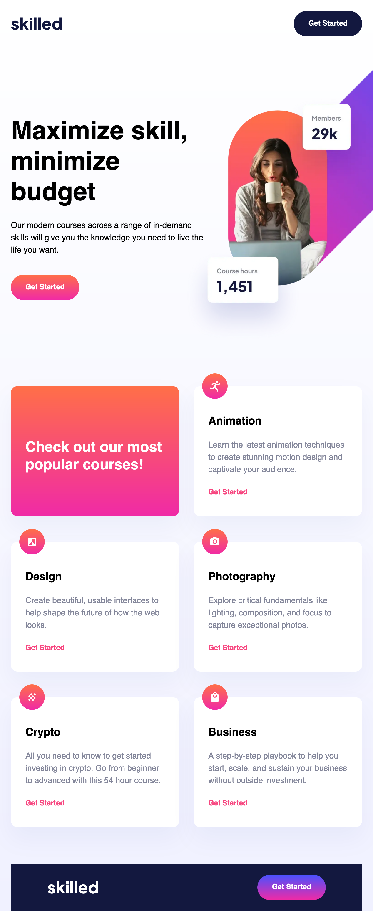

# Frontend Mentor - Skilled e-learning landing page solution

Frontend Mentor challenges help you improve your coding skills by building realistic projects.

## Table of contents

- [Overview](#overview)
  - [The challenge](#the-challenge)
  - [Screenshot](#screenshot)
  - [Links](#links)
- [My process](#my-process)
  - [Built with](#built-with)
  - [What I learned](#what-i-learned)
- [Author](#author)

## Overview

### The challenge

Users should be able to:

- View the optimal layout depending on their device's screen size
- See hover states for interactive elements

### Screenshot

### Links

- Solution URL: [https://github.com/LukasT1/fm-easy-skilled-landing-page]
- Live Site URL: [https://LukasT1.github.io/fm-easy-skilled-landing-page]

## My process

### Built with

- Semantic HTML5 markup
- SCSS
- CSS custom properties
- Flexbox
- CSS Grid
- Desktop-first workflow

### What I learned

The biggest challenge I encountered was the hero image. I refreshed my memory how to use responsive images in my HTML markup.

But the provided assets had a lot of blank space around them. I decided to trim all of them using Photoshop. But still the shadows and the aspect ration of the image made it difficult to position them correctly according to the design files.

I had to use some negative margins so it felt a bit messy.

But in the end it worked out. I did not have to write too much media queries since I used CSS Grid for most of it.

In the end I am quite satisified with this. Was it not for the troubles with the images I would have tackled this much quicker.

## Author

- Frontend Mentor - [@LukasT1](https://www.frontendmentor.io/profile/LukasT1)
